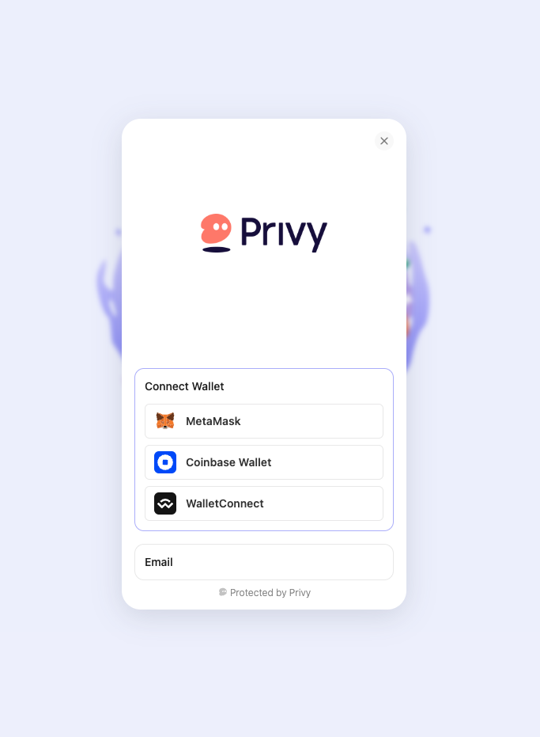
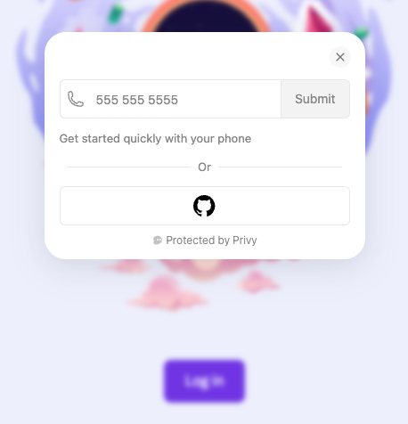

Privy makes authentication and user-management in Web3 easy by bridiging both onchain and onchain user data. In preparation to dive into our Base Paymaster example app, in this lesson we'll cover the basics of Privy.

---

## Objectives

By the end of this lesson you should be able to:

- Implement Privy's Quickstart to add onchain athentication to a NextJS application.

- Describe Privy's progressive authentication strategy and how it makes user managament easy.
- Use Privy's `PrivyProvider` context and `usePrivy` hook to implement basic authentication, allowing use to authentication using an email address, SMS, EOA and social applications.
- Utilize Privy's Embedded Wallets to enable users to utilize wallet-based actions without having to connect to an external wallet or leave your application.

---

## What You'll Build

Thoughout the next few lessons, we'll build a sample application where users can authenticate with [Privy](https://www.privy.dev/), create a Smart Contract Wallet with [Alchemy's Account Kit](https://www.alchemy.com/account-kit), and mint an NFT without paying gas fees thanks to the [Goerli Base Paymaster](https://github.com/base-org/paymaster)!

Feel free to skip ahead by checking out our example app, or stick around to learn the fundamentals of Privy.

---

## Overview of Privy

Privy self describes as "a simple toolkit for progressive authentication in web3". In our example app, we're primarily using Privy for it's authentication and user-handling capabilities, but some of Privy's most popular features include:

**Authentication Options**: Privy allows developers to configure how users authenticate. This can be with a crypto wallet, an email address, phone number or social profiles. Conviently, Privy handles sessions and provides all necessary authentication methods such as `login` and `logout` in addition to user like `authenticated`.

**Progressive Onboarding**: Privy creates a `user` object for each session. Before authentication, this `user` object is `null`, but as the user interacts with your application you can progressively associate more user information with this object. For example, users can start by authenticating with their email address and later add their wallet address or any other user information as the application requires.

**Embedded Wallets**: We will not be using this feature in our example application, but Privy describes their Embedded Wallets as, "self-custodial Ethereum wallets that are embedded into your app. This allows your users to take wallet-based actions without ever leaving your site. Embedded wallets are the easiest way to unlock your full product experience for users who don't have, or don't want to connect, their own wallet." Developers can simply configure Privy to automatically created an Embedded Wallet on `login` or they can be pregenerated on the backend. Note: "embedded wallets" are ultimately EOAs and should not be confused with "smart contract wallets".

---

## Privy Quick Start

In order to learn Privy apart from the rest of our example code, we'll go through [Privy's Quick Start](https://docs.privy.io/guide/quickstart).

For a brand new application, you can choose to utilize a starter template from **NextJS** or **Create React App**. Since our example application is using NextJS, we'll take a look at that starter template.

#### Cloning the template

First, navigate to the repository: [https://github.com/privy-io/create-next-app](https://github.com/privy-io/create-next-app).

According to the README directions, we'll clone this repo: `git clone https://github.com/privy-io/create-next-app`.

#### Installing dependencies

Next, `cd create-next-app` and install dependencies with `npm i`.

#### Setting your app idh

To use Privy, you'll need your own environment variables. In your terminal, run:

```
cp .env.example .env.local
```

This will create a `.env.local` file in your project's root. This is where you'll add your Privy App ID:

```
NEXT_PUBLIC_PRIVY_APP_ID=<your-privy-app-id>
```

> :warning: Note - to get an App ID, you'll need to request one and access it at [https://console.privy.io/](https://console.privy.io/). This process can take a while, but for the Base community, Privy will expidite this process (a couple of hours)! Developers can send an email to `base@privy.io` with:
>
> - Your app name
> - The email address you want as admin
> - A one liner on what you're building

#### Starting the app

Finally, run `npm run dev` and navigate to [http://localhost:3000](http://localhost:3000/) to see the starter application.

---

## Privy Login Walkthrough

Before exploring the code, let's test the app. First, you should see this login page:


After clicking "Log in" you'll see the following modal:



By default, you can login with a wallet, or email.

After logging in, you'll be redirected to the `/dashboard` page, where the demo app will allow you to connect a number of other accounts to your `user` object:


If you navigate to [console.privy.io](https://console.privy.io/), you'll see that Privy stores all your users and their data here.


---

## PrivyProvider

Diving into the code, we'll first look at the `PrivyProvider` inside of `_app.jsx`:

```js
<PrivyProvider
  appId={process.env.NEXT_PUBLIC_PRIVY_APP_ID || ''}
  onSuccess={() => router.push('/dashboard')}
>
  <Component {...pageProps} />
</PrivyProvider>
```

`PrivyProvdider` uses React Context and should wrap any components that will use the `usePrivy` hook.

Additionally, it's here that you can pass an optional `config` property to enable more authentication methods.

Let's try it now. Make the code inside of `<PrivyProvider />` in `_app.jsx` look like this:

```js
<PrivyProvider
  appId={process.env.NEXT_PUBLIC_PRIVY_APP_ID || ''}
  onSuccess={() => router.push('/dashboard')}
  config={{
    loginMethods: ['github', 'sms'],
  }}
>
  <Component {...pageProps} />
</PrivyProvider>
```

Refresh to see that authentication is only possible now through Github or SMS:



---

## `usePrivy` Hook

The primary method you'll use to utilize Privy's authentication features is `usePrivy`. A full list of the fields and methods returned from `usePrivy` are [documented here](https://docs.privy.io/reference/react-auth/interfaces/PrivyInterface), but check out your [starter app](https://github.com/privy-io/create-next-app) to see where we're using `login`, `ready`, `authenticated`, `user` and more.

---

## `useWallets` Hook

To access wallet data for currently authenticated user, use this hook:

```js
import { ConnectedWallet, useWallets } from '@privy-io/react-auth';

const { wallets } = useWallets();

// wallets = [
//   {
//     "address": "0xa6509B6445B057D6173F4161167347830E20105B",
//     "type": "wallet",
//     "verifiedAt": "2023-11-28T20:09:23.000Z",
//     "chainType": "ethereum",
//     "chainId": "eip155:1",
//     "walletClient": "unknown",
//     "walletClientType": "metamask",
//     "connectorType": "injected"
//   },
//   {
//     "address": "0xB51AA0728812643B39FaA4b6EfF91AFe88899F7D",
//     "type": "wallet",
//     "verifiedAt": "2023-11-28T19:01:41.000Z",
//     "chainType": "ethereum",
//     "chainId": "eip155:84531",
//     "walletClient": "unknown",
//     "walletClientType": "coinbase_wallet",
//     "connectorType": "coinbase_wallet"
//   }
// ],
```

As you can see, a user may connect multiple wallets to Privy, including Embedded Wallets.

---

## Embedded Wallets

Lastly, we'll configure our starter app to create an Embedded Wallet for our users on login. Note, we don't use this feature in our Account Abstraction example application, but it's worth exploring here.

As stated in the Privy docs,

> Embedded wallets are self-custodial Ethereum wallets that are embedded into your app. This allows your users to take wallet-based actions without ever leaving your site. Embedded wallets are the easiest way to unlock your full product experience for users who don't have, or don't want to connect, their own wallet."

When it comes to creating an Embedded Wallet on login, we have 2 options:

- `users-without-wallets`: This will create embedded wallets for all use who did not login with an external wallet.
- `all-users`: This will create an additional embedded wallet for all users, regardless if they have linked an external wallet.

Inside of `_app.tsx`, make your `PrivyProvider` look like this:

```js
<PrivyProvider
  appId={process.env.NEXT_PUBLIC_PRIVY_APP_ID || ''}
  onSuccess={() => router.push('/dashboard')}
  config={{
    embeddedWallets: {
      createOnLogin: 'all-users'
    }
  }}
>
```

Logout of your application, then log in again and see that your user has an additional `linkedAccount` which is the Privy Embedded Wallet:

```js
{
  "address": "0xD5063967BA703D485e3Ca40Ecd61882dfa5F49b2",
  "type": "wallet",
  "verifiedAt": "2023-11-28T20:52:22.000Z",
  "chainType": "ethereum",
  "chainId": "eip155:1",
  "walletClient": "privy",
  "walletClientType": "privy",
  "connectorType": "embedded",
  "recoveryMethod": "privy"
},
```

More information on Privy's Embedded Wallets, including information about the addresses, signing transactions, fundinging the wallet and more, can be found here: [https://docs.privy.io/guide/frontend/embedded/overview](https://docs.privy.io/guide/frontend/embedded/overview)

---

## Conclusion

With Privy, onboarding users to your applications is easy. Offchain user data that is meant to be offchain is [securely stored](https://docs.privy.io/guide/security#user-data-management) in the Privy console, while onchain data is stored onchain via a user's connected wallet, whether that be an external wallet, or an embedded wallet.
